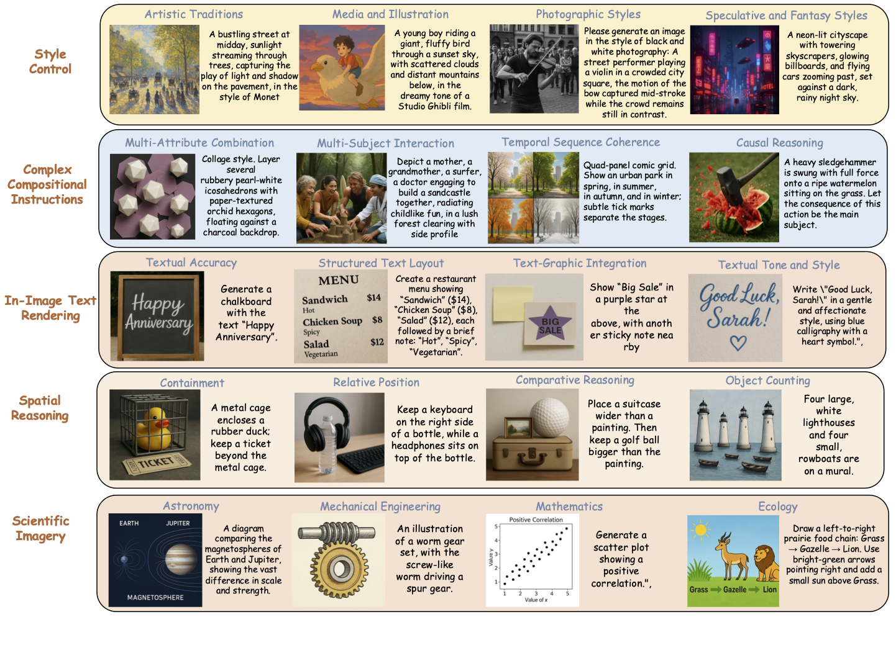
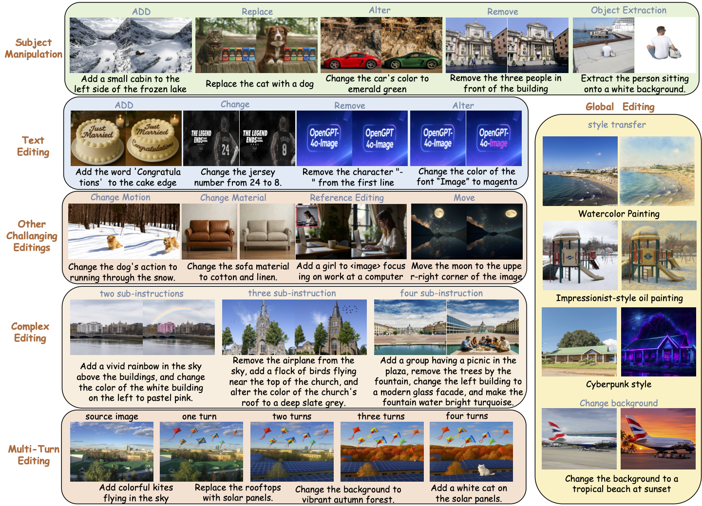

# OpenGPT-4o-Image：A Comprehensive Dataset for Advanced  Image Generation and Editing
<!-- <div align="center">

 **arXiv Paper:** [](https://arxiv.org/pdf/2505.21333) &nbsp;&nbsp;&nbsp; **Dataset:** [](https://huggingface.co/datasets/WINDop/OpenGPT-4o-Image)

</div> -->

<div align="center">
  <h4>
 📃 <a href="https://arxiv.org/abs/2506.18095" target="_blank">Paper</a>
</h4>
<h4>
  🤗 <a href="https://huggingface.co/datasets/WINDop/OpenGPT-4o-Image" target="_blank">OpenGPT-4o-Image</a>
</h4>
</div>


---

## Introduction
We introduce **OpenGPT-4o-Image**, a large-scale dataset constructed using a novel methodology that combines hierarchical task taxonomy with automated data generation. Our taxonomy not only includes fundamental capabilities such as text rendering and style control but also introduces highly practical yet challenging categories like **scientific imagery** for chemistry illustrations and **complex instruction editing** requiring simultaneous execution of multiple operations. Through an automated pipeline leveraging structured resource pools and GPT-4o, we generate 80k high-quality instruction-image pairs with controlled diversity, covering 11 major domains and 51 subtasks.

<div align=center>

</div>

---

## OpenGPT-4o-Image Dataset

This dataset is designed for text-to-image and image editing tasks. It is split into two main parts:

*   **Text-to-Image Generation**: Generating images from textual descriptions.
*   **Image Editing**: Modifying existing images based on instructional prompts.

| Data Type               | Number of Samples |
| ----------------------- | ----------------- |
| Text-to-Image Generation         | ~40k            |
| Image Editing | ~40k           |
| **Total**               | **~80k**        |

## Quick Start

### 1. Download from Hugging Face

First, download all the split archive files (`gen.tar.gz.*` and `editing.tar.gz.*`) from the [Hugging Face repository](https://huggingface.co/datasets/WINDop/OpenGPT-4o-Image).

### 2. Decompress the Files

The dataset is split into multiple archives. Use the following commands in your terminal to merge and extract them.

```bash
# Decompress the text-to-image generation data
cat gen.tar.gz.* | tar -xzvf -

# Decompress the image editing data
cat editing.tar.gz.* | tar -xzvf -
```

After running these commands, you will get the `OpenGPT-4o-Image` directory containing all the data.

## Dataset Structure

The decompressed directory has the following structure:

```
├── OpenGPT-4o-Image
│   ├── gen/              # Contains images for the generation task
│   ├── editing/          # Contains input/output images for the editing task
│   ├── gen.json          # Annotations for the generation task
│   └── editing.json      # Annotations for the editing task
```

## Data Format

The dataset annotations are provided in two JSON files, corresponding to the two sub-tasks. Each line in the JSON file is a JSON object.

### `gen.json` (Text-to-Image Generation)

This file contains prompts and their corresponding generated image paths.

*   `input_prompt`: The text prompt used for image generation.
*   `output_image`: The relative path to the generated image.

**Example:**
```json
{
  "input_prompt": "Collage style. Weave several satin‑finish orchid hexagons with woolen peach cubes, floating against a gradient backdrop.",
  "output_image": "gen/0.png"
}
```

### `editing.json` (Image Editing)

This file contains editing instructions, input images, and the resulting output images.

*   `input_prompt`: The instruction describing the desired edit.
*   `input_image`: A list containing the relative path to the source image to be edited.
*   `output_image`: The relative path to the edited result image.

**Example:**
```json
{
  "input_prompt": "Remove the word 'SALAD' at the top of the chalkboard.",
  "input_image": [
    "editing/input_0.png"
  ],
  "output_image": "editing/output_0.png"
}
```

## Citation

If you use this dataset in your research, please consider citing:

<!-- ```bibtex
@misc{opengpt4o_image_dataset_2024,
  author    = {Your Name/Organization},
  title     = {OpenGPT-4o-Image Dataset},
  year      = {2024},
  publisher = {Hugging Face},
  url       = {https://huggingface.co/datasets/WINDop/OpenGPT-4o-Image}
}
``` -->


## 💡 Representive Examples of Each Domain
<!--  -->

<div align=center>

</div>

<div align=center>

</div>
