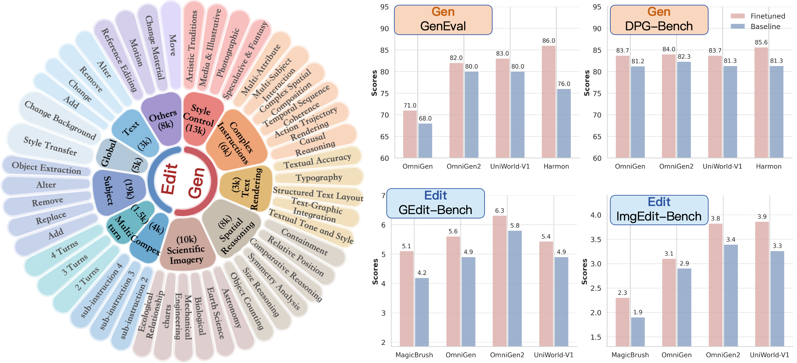

# OpenGPT-4o-Image：A Comprehensive Dataset for Advanced  Image Generation and Editing

## Introduction
We introduce **OpenGPT-4o-Image**, a large-scale dataset constructed using a novel methodology that combines hierarchical task taxonomy with automated data generation. Our taxonomy not only includes fundamental capabilities such as text rendering and style control but also introduces highly practical yet challenging categories like **scientific imagery** for chemistry illustrations and **complex instruction editing** requiring simultaneous execution of multiple operations. Through an automated pipeline leveraging structured resource pools and GPT-4o, we generate 80k high-quality instruction-image pairs with controlled diversity, covering 11 major domains and 51 subtasks.

## OpenGPT-4o-Image
| Data Type               | Number of Samples |
| ----------------------- | ----------------- |
| Text-to-Image Generation         | ~40k            |
| Image Editing | ~40k           |
| **Total**               | **~80k**        |

## Citation
